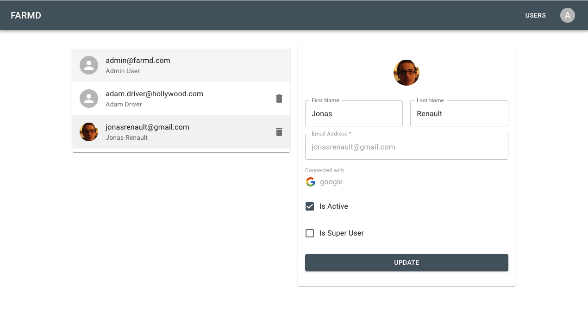

# Fastapi-React-Mongodb-Docker


[](LICENSE)


This is a template application for a FARM stack. FARM stands for FastAPI, React, MongoDB.

## Features

### Clean design with minimal dependencies

[](https://github.com/jonasrenault/fastapi-react-mongodb-docker)

### Basic user management with OAuth2 SSO

[](https://github.com/jonasrenault/fastapi-react-mongodb-docker)

## Project structure

The project is composed of :

* a backend API server built with FastAPI located in the [backend](backend) dir.
* a frontend web app build with React and located in the [frontend](frontend) dir.

## Running the application locally for development

To run the application manually in a terminal, see both the [backend](backend/README.md) and [frontend](frontend/README.md)'s READMEs for instructions.

## Running the application with Docker

The project contains Docker configuration files to run the application with Docker compose. Two docker-compose files are provided with configuration for `dev` and for `production` environments. The Docker configuration is largely adapted from Tiangolo's [Full stack FastAPI template](https://github.com/fastapi/full-stack-fastapi-template) project.

### Local development with Docker

The local development file for docker is [docker-compose.yml](./docker-compose.yml).

Start the stack with Docker Compose:

```bash
docker compose watch
```

You can then open your browser and interact with these URLs:

* Frontend, served with vite with hot reload of code: http://localhost

* Backend, JSON based web API based on OpenAPI, with hot code reloading: http://localhost/api/v1

* Automatic interactive documentation with Swagger UI (from the OpenAPI backend): http://localhost/docs

* Alternative automatic documentation with ReDoc (from the OpenAPI backend): http://localhost/redoc

* Traefik UI, to see how the routes are being handled by the proxy: http://localhost:8090

Once the stack is up, to check the logs, run:

```bash
docker compose logs
```

To check the logs of a specific service, add the name of the service, e.g.:

```bash
docker compose logs backend
```

To get access to a bash session inside a container (e.g. the `backend`):

```console
$ docker compose exec backend bash
```


### Docker Compose settings for production

The [docker-compose-prod.yml](./docker-compose.prod.yml) file contains the configuration to run the application with docker in a production environment, on a host server. To run the application with this file, run

```console
docker compose -f docker-compose.prod.yml up -d
```

**Note:** This will not work out of the box, mainly because the `docker-compose-prod.yml` configures a traefik proxy with ssl enabled that will try to fetch ssl certificates from Let's Encrypt, which will not work unless you specify a valid hostname accessible on the internet. However, to deploy the application in production on a server, you only need to set the required env variables in the [.env](./.env) file.

When using the production configuration, the frontend app is built into static files and the app is served by an nginx server. The [nginx configuration file](frontend/nginx.conf) is in the frontend dir.

### Docker Compose files and env vars

Both the [docker-compose.yml](./docker-compose.yml) and [docker-compose-prod.yml](./docker-compose.prod.yml) files use the [.env](./.env) file containing configurations to be injected as environment variables in the containers.

The docker-compose files are designed to support several environments (i.e. development, testing, production) simply by setting the appropriate variable values in the `.env` file.

The [.env](./.env) file contains all the configuration variables. The values set in the `.env` file will override those that are set in the frontend `.env` files for local development.

The `.env` file that is commited to the github repository contains example values which are ok to use for testing and development, but which should be changed when running the application in production (admin passwords, secret keys, client ids, etc.). During deployment in production, the .env file is replaced with one containing the appropriate values.

## Setting up Single Sign-On (SSO) with google

To setup SSO and enable the `Sign-In with Google` button, you must first obtain a client-id and secret token from Google. Follow [these steps](https://developers.google.com/identity/protocols/oauth2) to obtain client credentials from your [Google Cloud Console](https://console.cloud.google.com/).

Create a new project, and from the `APIs & Services` menu, first create an `OAuth consent screen` for you application, then add an `OAuth 2.0 Client Id` in the `Credentials` menu. Select `Web application` as the application type. In the `Authorized redirect URIs`, add your hostname with the `api/v1/login/google/callback` endpoint. For instance, if testing locally while running the backend app with `uvicorn`, add `http://localhost:8000/api/v1/login/google/callback` (use `http://localhost/api/v1/login/google/callback` if running the application in dev with docker). If your application is hosted on a domain name, add it to the list of URIs (remember to update `http` to `https` when using SSL).

Once you've create a client-id and token in your Google cloud console, copy those into your `.env` file's `GOOGLE_CLIENT_ID` and `GOOGLE_CLIENT_SECRET` variables.

## Setting up automatic build of the docker images in github

The project has a [build workflow](./.github/workflows/build.yml) configuration to build the docker images for production and publish those into your Github package registry. To do this, you must first create a [Github Environment](https://docs.github.com/en/actions/deployment/targeting-different-environments/using-environments-for-deployment) for your project (call this environment `prod` or update the environment name in the workflow configuration.

You also need to add an environment secret variable `SERVER_ENV_PROD` which should contain the root `.env` file with the variables set for your production environment (simply copy-paste the contents of the env file as the github secret). This secret environment variable will be used by the github workflow to build the docker images with the [docker-compose.prod.yml](./docker-compose.prod.yml) file.

Finally, enable write permission for the `GITHUB_TOKEN` to enable pushing images to your package registry: Go to `Settings` > `Actions` > `General` and check `Read and write permissions` under `Workflow permissions`.
